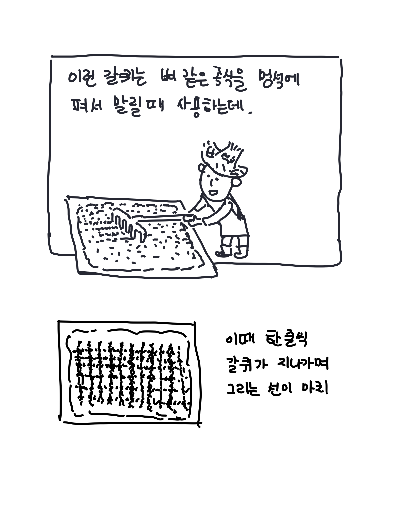

포토샵이나 일러스트레이터를 사용하다보면 흔히 만날 수 있는 용어인 레스터화. 그런데 왜 픽셀화가 아니라 레스터화라 부르는지 궁금했었다. 레스터화라는 것은 결국 무언가를 레스터로 바꾼다는 것인데, 레스터화는 무엇이고 굳이 왜 레스터화가 필요한지도 궁금해졌다. 사실 이러한 의문을 일으킨 가장 근본적인 문장이 있었는데, WebGL의 기본 개념에 대한 설명이었다.

> WebGL API는 단순히 레스터라이저(rasterizer)이며 개념적으로 매우 간단합니다.

새로운 개념을 배우고 쌓아가기 가장 좋은 방법 중 하나는 누군가를 가르치는 일이라고 한다. 그런데 배운 것을 당장 가르친다고 생각하면 너무 아득하고 두려운 것은 사실이다. 다행히 내게는 이렇게 개념을 그림으로 설명해보는 것은 가르치는 것과 비슷한 효과를 얻을 수 있는 (심지어 과정도 재미있는)방법이 될 수 있을 것 같다.

