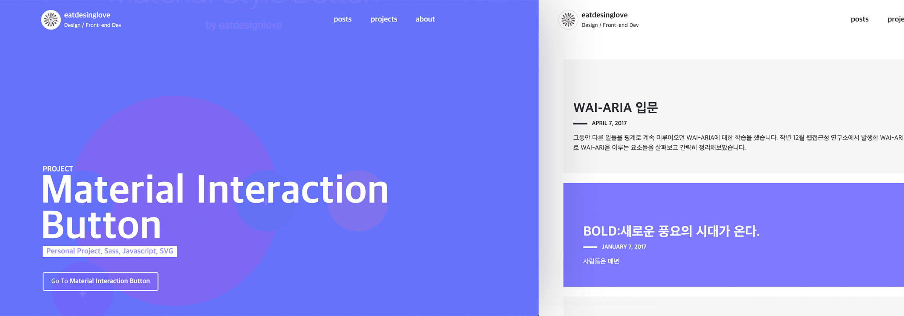

### 시작은 2018년 회고
작년 말, 많은 분들이 SNS를 통해 공유해주셨던 2018년 회고 속에 담긴 다양한 도전과 실천의 흔적은 저 스스로를 되돌아보는 계기가 되었습니다. 저도 연말에 고향에 내려가 가족들과 모여 회고를 했습니다. 연초에 세웠던 각자 목표를 리뷰하고, 새해 계획을 세워 서로 공유하는 가족 행사인데, 그날따라 조그맣게 적힌 저의 실패한 목표가 눈에 들어왔습니다.

> "블로그를 운영하며, 배운 것과 생각한 것 공유하기"

세웠던 목표에 대한 별다른 노력없이 시간을 보낸 스스로가 부끄러웠습니다. 2019년에는 그 목표를 반드시 실행하기로 결심하고, 그동안 방치해두었던 케케묵은 블로그를 새롭게 단장하기로 했습니다. 

---
### 목표는 그저 나를 남기는 공간
그냥 제 자신을 즐겁게 담아낼 공간이면 자연스레 잘 관리할 수 있지 않을까란 생각에 떠오르는대로 아이디어를 구체화한 작업들, 관심분야의 활동들, 생각들을 담아낼 수 있는 일종의 포트폴리오의 형태로 블로그를 구성했습니다. 특별한 기능이 필요한게 아니라 대부분의 블로그의 구성에서 벗어나지 않지만 먼저 스스로 생각한 요구사항을 정리해봤습니다.

- Gatsby를 활용해 만든다.
- 직접 디자인한 UI로 화면을 구성한다. (블로그 + 포트폴리오)
- 댓글, SNS 공유 기능이 있다.
- 질질끌지 않고 1주일 내 완성한다.

---

### Gatsby는 어떻게 동작할까

시각화

---

### 작업 시작
#### 1. Gatsby(React, GraphQL)를 활용해 만든다.
기존에 만들어두었던 블로그는 [Jekyll](https://jekyllrb.com/)을 기반으로 만들어졌습니다. 보완할 곳은 있었지만 운영하는데에 문제는 없어서 굳이 다시 만들 이유는 없었습니다만, React로 정적 사이트를 만드는 도구인 Gatsby와 더불어 GraphQL도 살펴볼 수 있는 기회라는 생각에 새롭게 만들어보기로 했습니다. 많은 분들께서 경험하고 작성해주신 튜토리얼을 나침반삼아 구성해보고, 이미 만들어진 테마를 살펴보며 참고하며 만들었습니다.

##### 간략하게 정리해 본 Gatsby 블로그 만들기 과정.


##### 1. 프로젝트 구성하기
```shell
npx gatsby new gatsby-site
cd gatsby-site
npm run develop
```

##### 2. 포스트 목록 구성하기
```
//
```

##### 3. 포스트 상세화면 구성하기
```
//
```

##### 4. 이미지 불러오기
```
//
```

##### 5. 페이지네이션 적용하기
```
//
```

##### 6. Netlify로 배포하기
```
//
```

---

#### 참고한 자료들
- [Gatsby 공식 튜토리얼](https://www.gatsbyjs.org/tutorial/)
- [Nicky Meuleman님의 Pagination in GatsbyJS](https://nickymeuleman.netlify.com/blog/gatsby-pagination/)
- [StackShare, Jekyll vs. Hugo vs. Gatsby](https://stackshare.io/stackups/gatsbyjs-vs-hugo_2-vs-jekyll)
- [Rinae님의 'Gatsby를 활용한 블로그 재구성'](https://adhrinae.github.io/posts/creating-new-blog-with-gatsby/)
- [Hyeseong Kim님의 '나만의 블로그 개발하기 - 0. 플랫폼 선정'](https://blog.cometkim.kr/posts/%EB%82%98%EB%A7%8C%EC%9D%98-%EB%B8%94%EB%A1%9C%EA%B7%B8-%EA%B0%9C%EB%B0%9C%ED%95%98%EA%B8%B0/0-%ED%94%8C%EB%9E%AB%ED%8F%BC-%EC%84%A0%EC%A0%95/)
- [ahnheejong님의 '블로그 재작성 작업기'
](https://ahnheejong.name/articles/remaking-blog/)
- [GraphQL 공식 홈페이지](https://graphql.org/)
- [Outsider님의 '정적 사이트 생성기 Gatsby'](https://blog.outsider.ne.kr/1426)
- [노마드코더, GraphQL로 영화 API 만들기](https://academy.nomadcoders.co/p/make-a-movie-api-with-graphql-and-nodejs-super-begginner)
- [Hosting on Netlify](https://www.gatsbyjs.org/docs/hosting-on-netlify/)
- [A Step-by-Step Guide: Gatsby on Netlify](https://www.netlify.com/blog/2016/02/24/a-step-by-step-guide-gatsby-on-netlify/)

#### 2. 직접 디자인한 UI로 화면을 구성한다.
돌이켜보면 그동안 블로그를 어떻게 만들면 **독특하고 재미있을까**를 고민했던 것 같습니다. 그래서인지 늘 '화면을 어떻게 구성할지' 고민하다 정작 '블로그 운영하기'를 못하는 불상사를 겪어왔던 거지요. 놀랍게도 이번에도 조금 비슷했습니다...만 다행이 그동안 꾸준히 고민해왔던 부분들이 있었고, 연초버프로 의욕도 넘쳤기에 큰 고비를 넘기고 다행히 이 글을 쓰고 있습니다.



끄적거려두었던 디자인 파일을 열어 원하는 형태로 수정 후 기본적인 UI를 구현하고, 점차 코드로 디자인을 개선해가는 방식으로 작업을 이어갔습니다. 최초 시안에는 본문의 문단 배치가 왼쪽으로 치우쳐있었습니다. GNB 메뉴도 세로로 배치했었습니다. 이는 독특한 이미지를 주긴하지만 읽는이에게 불편감을 줄 수 있다는 판단에 자주 방문하던 콘텐츠 중심의 웹사이트 디자인을 분석해보고 벤치마킹하기로 했습니다. 아래와 같이 몇 가지 내용으로 정리하고 차용할 부분들 정리했습니다.

##### Medium
- 성격: 다양한 주제의 콘텐츠를 다루는 미디어 채널
- 고정 GNB
- 카테고리 / 타이틀 / 서브타이틀 / 프로필 / 글 정보 순 배치
- **눈에 띄는 이미지 배치 레이아웃**
- **본문 가운데 정렬**
- 왼쪽 플로팅 공유버튼 / 하단 고정 공유버튼
- 하단 태그
- 최하단 관련 콘텐츠 제공

##### Uber Design
- 성격: 특정 주제(Uber design)의 결과물(프로젝트)를 다루는 채널
- 스크롤에 따라 보여지는 상단 Sticky GNB
- **거대한 타이틀 ,히어로 이미지, 해당 프로젝트의 요약을 정리**
- **다양한 레이아웃을 포함한 콘텐츠 디자인**
- **콘텐츠 시선의 시작지점은 가운데로부터**
- 본문 제목은 라벨링하여 네비게이션 제공
- 최하단 관련 콘텐츠 제공

제 블로그 역시 결과물 중심의 콘텐츠로 채워나갈 예정이라 분석한 두 개의 채널의 장점을 적절히 합쳐보면 좋을 것 같았습니다. 그 결과, 본문을 읽을 때 시선의 위치가 너무 한쪽으로 치우치지 않도록 가운데에서 본문이 시작되는 레이아웃으로 재구성하고 다채롭진 않지만 이미지를 필요에 따라 2개의 컬럼으로 나누어 배치할 수 있도록 구성했습니다. 작업하면서 더 추가하고 싶은 부분들이 있었지만 우선 후순위항목으로 처리하기로 했습니다.

#### 3. 댓글, 공유 기능이 있다.

처음 댓글 기능을 위해 Disqus 플러그인을 붙였는데, 제공된 Disqus의 일부 디자인 요소들이 눈에 거슬리는 부분들이 있어서 일단 다시 떼어냈습니다. 

#### 4. 질질끌지 않고 1주일 내 완성한다.

결론부터 말하자면, 이 목표는 실패했습니다. 사실 일반적인 블로그 구성과 같아서 레퍼런스들을 찾아 작업하기에 큰 어려움은 없었습니다만, 여차저차하다보니 2주나 시간이 흘러버렸습니다. 추가적인 디자인 개선 등을 포함하면 '이정도면 될 것 같은데'라는 생각이 들 정도까지 오는데 1달 가까이 걸린 듯 합니다. 늘 욕심이 문제입니다. 흑흑..

작업은 주로 '와다닥'으로 명명한(모각코와 비슷한 컨셉의) 사내 스터디을 통해 진행하고 상황을 공유했는데, 덕분에 중간에 이런저런 핑계대며 멈추지 않고 작업을 마무리를 지을 수 있었습니다.

---

### 마무리

아직 더 작업하고 싶은 부분들이 남아있지만, TODO로 설정해두고 하나씩 채워가보려 합니다. 

예전에는 영감이란 **불현듯 찾아오는 멋진 아이디어**라고 생각했습니다. 그런데 얼마전부터 생각이 조금 바뀌었습니다. **실현된 아이디어가 세상에 주는 영향력이 곧 영감이지 않을까**란 생각을 하게 된 것이지요. 구현된 한 줄의 코드, 그려진 한 폭의 그림, 쓰여진 한 문장의 글. 

생각이 머리 속에만 남아있는 것이 아닌 실제로 세상에 모습을 드러내고, 그 과정에서 들어간 노력과 열정 자체가 다른 사람들의 마음과 몸을 움직이게 하는 영감이 된다는 생각입니다. 블로그는 그런 활동을 공유할 수 있는 좋은 매개가 될 수 있을 것 같습니다.

이번에 새로 단장한 블로그를 통해 다른 분들의 훌륭한 창작물들을 소비만 하는 것이 아닌, 저 역시 세상에 영감을 줄 수 있도록 다양한 활동과 생각들을 꾸준히 담아보도록 하겠습니다. 부디 올 해는 행동하는 한 해를 만들 수 있기를 다시 한 번 결심해봅니다.
