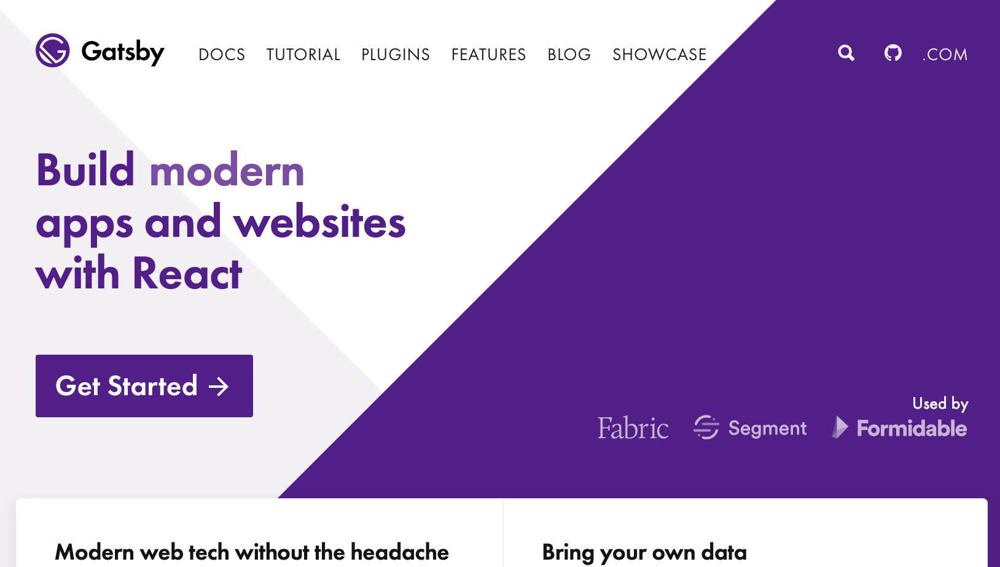
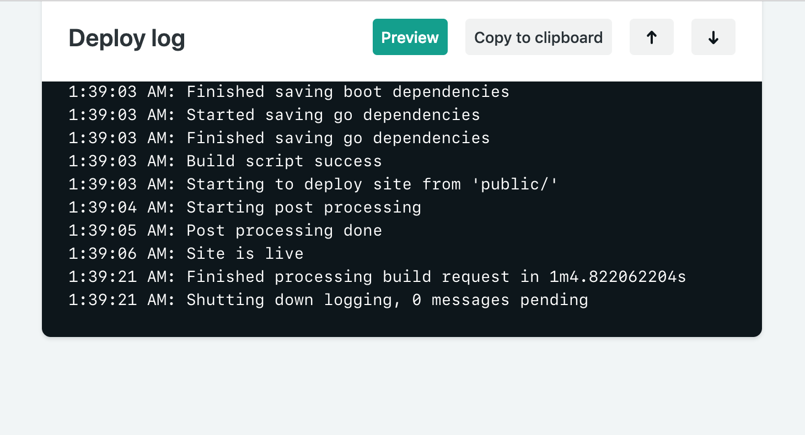
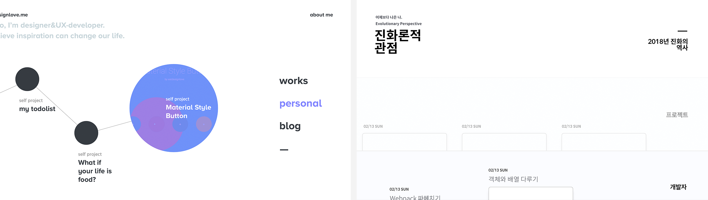
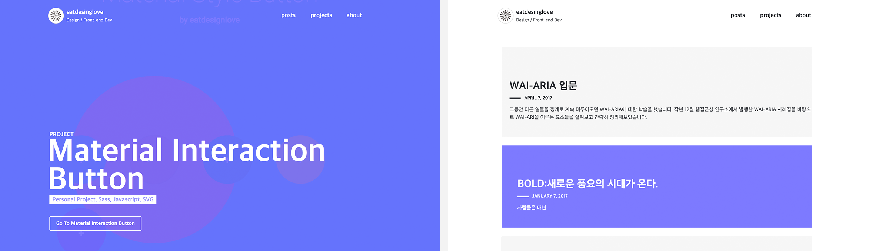
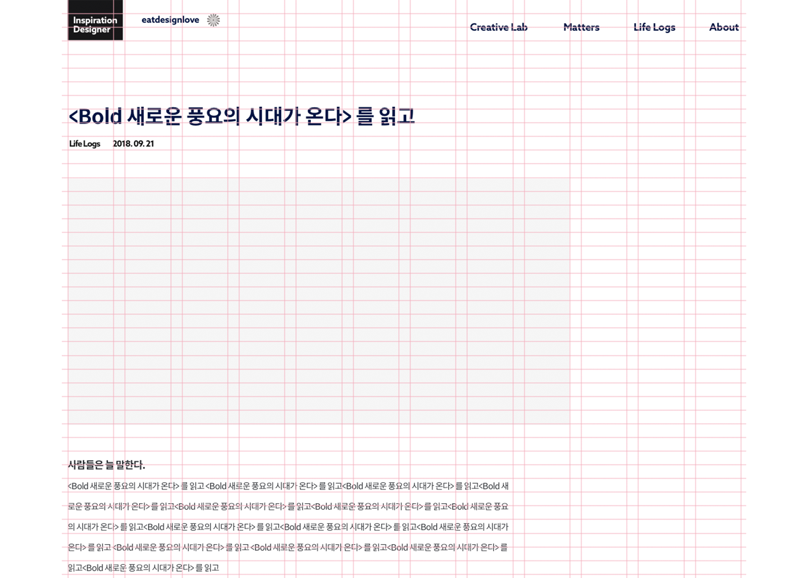
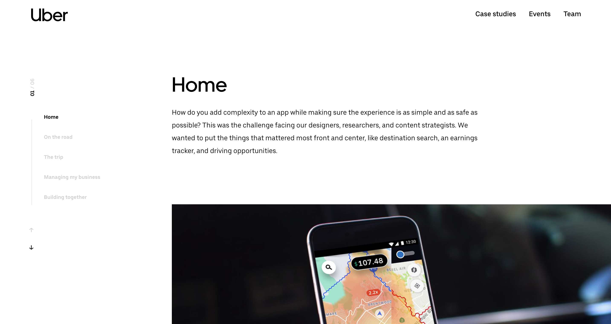

### 시작은 2018년 회고.
작년 말, 많은 분들이 SNS를 통해 공유해주셨던 2018년 회고 속에 담긴 다양한 도전과 실천의 흔적은 저 스스로를 되돌아보는 계기가 되었습니다. 저도 연말에 고향에 내려가 가족들과 모여 회고를 했습니다. 연초에 세웠던 각자 목표를 리뷰하고, 새해 계획을 세워 서로 공유하는 가족 행사인데, 그날따라 조그맣게 적힌 저의 실패한 목표가 눈에 들어왔습니다.

> "블로그를 운영하며, 배운 것과 생각한 것 공유하기"

해야지, 해야지 생각만 하고 세웠던 목표에 대한 별다른 노력없이 보낸 스스로가 부끄러웠습니다. 😢 2019년에는 그 목표를 반드시 실행하기로 결심하고, 그동안 방치해두었던 케케묵은 블로그를 새롭게 단장하기로 했습니다. 그러면서 몇가지 가이드를 세웠습니다.

- 정적 웹사이트 생성기 Gatsby로 만든다.
- UI는 직접 그린다.
- 댓글, 공유 기능이 있다.
- 질질끌지 않고 1주일 내 완성한다.

---

### 정적 웹사이트 생성기 Gatsby로 만든다

사실 오래 전에 [Jekyll](https://jekyllrb.com/)로 만들고 방치해두었던 블로그가 있었습니다. 보완할 곳은 있었지만 운영하는데엔 문제가 없어서 굳이 다시 만들 이유는 없었습니다만, 블로그를 다시 시작하면 [Gatsby](https://jekyllrb.com/)로 만들어보고 싶다란 생각을 이미 갖고 있었던터라 큰 고민 없이 새로 만들기로 결정했습니다. Gatsby를 통해 React로 화면을 구성할 수 있어 매력적이었고, 작업하면서 GraphQL을 살펴볼 수도 있는 기회라 생각했기 때문입니다.

#### 정적 웹사이트 생성기 Static Site Generator
이전에 사용하던 Jekyll도, 이번에 사용한 Gatsby도 모두 정적 웹사이트 생성기입니다. 일반적으로 **정적 웹사이트**란 데이터베이스를 이용하지 않고, 이미 생성된 콘텐츠를 화면에 바로 보여주는 사이트를 말합니다. 정적이란 단어가 쓰인 이유는 동적 웹사이트와의 차이 때문입니다. **동적 웹사이트**는 사용자가 화면에 진입할 때 데이터베이스에 요청하여 가져온 데이터를 템플릿에 반영하여 화면에 보여주는 방식의 사이트를 말합니다. 같은 블로그라도 WordPress같은 CMS가 MySQL이라는 데이터베이스를 통해 콘텐츠가 관리되는 동적 웹사이트 도구라면, Jekyll이나 Gatsby는 이미 빌드된 콘텐츠들을 바로 화면에 보여주는 정적 웹사이트 도구인 것입니다. 

이런 차이로 정적 웹사이트는 동적 웹사이트에 비해 데이터베이스 요청이 없으니 **빠르고**, 해킹 위협이 덜해 **보안문제가 적고**, **관리비용이 적게 드는** 등의 장점이 있습니다만 서드파티 서비스를 이용하지 않으면 **사용자 입력을 처리할 수 없고**, **실시간 콘텐츠를 제공하기 어려운 점** 등은 단점으로 꼽을 수 있습니다.

#### Gatsby

많은 정적 사이트 생성기들 중에서 Gatsby를 선택한 이유는 위에서 언급한 것처럼 단지 React와 GraphQL때문이었습니다. 이 글을 쓰면서 [Jekyll과 Gatsby 등을 비교해 둔 페이지](https://stackshare.io/stackups/gatsbyjs-vs-hugo_2-vs-jekyll) 등을 통해 다른 정적 사이트 생성기와의 차이를 살펴보기도 했는데, 어떤 정적 사이트 생성기를 쓸 것이냐의 문제는 해당  커뮤니티의 크기가 너무 작지만 않다면 결국은 개인취향에 달린 문제로 보였습니다.

*Gatsby 공식 사이트*

공식 웹사이트에 담긴 설명을 보면 마크다운뿐만 아니라 WordPress와 같은 CSM의 데이터나 API를 통해 데이터를 가져와 활용할 수 있고, 다양한 정적 웹 호스팅 서비스를 통해 배포할 수 있다고 설명하고 있습니다. 저의 경우도 많은 분들이 하신 것과 같이 기본적인 방식인 마크다운과 [Netlify](https://www.netlify.com/)를 통해 배포하는 방식을 선택했습니다. Netlify에 블로그로 사용하는 저장소를 설정한 후 특정 브랜치의 업데이트에 따라 자동으로 배포를 수행하도록 설정할 수 있어 Github Pages를 사용할 때에 비해 불편함은 없었고, 배포 상황을 콘솔을 통해 확인할 수도 있어서 좋았습니다.

*Deploy Console*

---

### 직접 디자인한 UI로 화면을 구성하기
돌이켜보면 그동안 블로그를 어떻게 만들면 **독특하고 재미있게 보일까**를 고민하는데 많은 시간을 들여온 것 같습니다. 그래서인지 늘 '화면을 어떻게 구성할지' 고민만하다 정작 '블로그 운영하기'를 못하는 불상사를 겪어왔던 거지요. 놀랍게도 이번에도 조금 비슷했습니다...만 다행이 그동안 꾸준히 고민해왔던 부분들이 있었고, 연초버프로 의욕도 넘쳤기에 놓아버리지 않고 다행히 이 글까지 쓸 수 있게 되었습니다. 

---
*이전 블로그 디자인들*

 우선 기본적인 UI를 구현하고, 코드를 작성하며 조금씩 디자인을 마음에 들도록 개선해가는 방식으로 작업을 이어갔습니다. 최초 시안에는 본문의 문단 배치가 왼쪽으로 치우쳐있었고 GNB 메뉴도 세로로 배치했었습니다. 이는 독특한 느낌를 주긴하지만 읽는이에게 불편함을 줄 수 있다는 판단에 자주 방문하던 콘텐츠 중심의 웹사이트 디자인을 분석해보고 벤치마킹하기로 했습니다. 아래와 같이 몇 가지 내용으로 정리하고 차용할 부분들 정리했습니다.

*수정중인 디자인 시안*

#### Medium
- 성격: 다양한 주제의 콘텐츠를 다루는 미디어 채널
- 고정 GNB
- 카테고리 / 타이틀 / 서브타이틀 / 프로필 / 글 정보 순 배치
- **심플한 이미지 배치 레이아웃**
- **본문 가운데 정렬**
- 왼쪽 플로팅 공유버튼 / 하단 고정 공유버튼
- 하단 태그
- 최하단 관련 콘텐츠 제공

---
*Uber Design Site*

#### Uber Design
- 성격: 특정 주제(Uber design)의 결과물(프로젝트)를 다루는 채널
- 스크롤에 따라 보여지는 상단 Sticky GNB
- **거대한 타이틀, 히어로 이미지, 해당 프로젝트 요약 정리**
- **다양한 레이아웃을 포함한 콘텐츠 디자인**
- **콘텐츠 시선의 시작지점은 가운데로부터**
- 본문 제목은 라벨링하여 네비게이션 제공
- 최하단 관련 콘텐츠 제공

제 블로그 역시 결과물 중심의 콘텐츠로 채워나갈 예정이라 분석한 두 개 채널의 장점을 적절히 합쳐보면 좋을 것 같았습니다. 그 결과, 본문을 읽을 때 시선의 위치가 너무 한쪽으로 치우치지 않도록 **가운데에서 본문이 시작되는 레이아웃**으로 재구성하고 다채롭진 않지만 이미지를 필요에 따라 화면 전체와 문단 위, 두 가지 타입으로 배치할 수 있도록 구성했습니다. 기본적으로 콘텐츠 작성을 마크다운으로 하다보니 원하는 레이아웃으로 배치하는 등 자유롭지 못한 부분, 부득이하게 마크다운을 작성할때의 나름의 작성 필요해진 부분은 조금 아쉬움이 남습니다.

---

### 댓글, 공유 기능이 있다.

처음에 댓글 기능을 위해 Disqus 플러그인을 붙였었는데, 제공된 Disqus의 일부 디자인 요소들이 눈에 거슬리는 부분들이 있어서 일단 다시 떼어냈고, 최근에 계속 눈여겨보던 깃헙 이슈를 이용한 댓글 위젯 [utterances](https://utteranc.es/)이나 페이스북 댓글 등 다른 방식을 고민하는 중입니다. 그러고보니 우선순위에서 밀려 공유 기능도 아직 넣어두지 않았네요. 조만간 반영해야겠습니다.

*Utterances 댓글 위젯*

---

### 질질끌지 않고 1주일 내 완성한다.

사실 일반적인 블로그 구성과 같아서 레퍼런스들을 찾아 작업하기에 큰 어려움은 없었습니다만, 여차저차하다보니 훌쩍 2주나 시간이 흘러버렸습니다. 추가적인 디자인 개선 등을 포함하면 '이정도면 될 것 같은데'라는 생각이 들 정도까지 오는데 1달 가까이 걸린 듯하네요. 늘 과한 고민과 욕심이 문제입니다.😢

작업은 주로 '와다닥'으로 불리는 사내 스터디을 통해 진행하고 상황을 공유했는데, 덕분에 중간에 이런저런 핑계대며 멈추지 않고 나아가는데 도움이 되었습니다. 

---

### 마무리

아직 디자인과 남은 몇가지 기능들을 더 개선하고 추가하고 싶지만, 만족할만한 순간이 도무지 찾아올 것 같지 않아 글쓰기를 통해 현재 진행한 정도까지만이라도 점을 찍어야 겠다는 생각이 들었습니다. 남은 작업은 계속해나가면 되니까요. 앞으로 알찬 내용들로 잘 채우는 것이 더 중요하겠지만 어쨌든 올해 목표 중 하나인 '블로그 다시 시작하기'에 첫걸음을 뗄 수 있어서 마음이 한결 가볍습니다. 

예전에는 영감이란 **불현듯 찾아오는 멋진 아이디어**라고 생각했습니다. 그런데 얼마전부터 생각이 조금 바뀌었습니다. 비록 실패하더라도 **실천된 아이디어가 세상에 주는 영향력이 곧 영감이지 않을까**란 생각을 하게 된 것이지요. 구현된 한 줄의 코드, 그려진 한 폭의 그림, 쓰여진 한 문장의 글처럼 작지만 정말로 세상에 부딪혀본 것들 말입니다.

생각이 머리 속에만 남아있는 것이 아닌 실제로 세상에 모습을 드러내고, 그 과정에서 들어간 노력과 열정 자체가 다른 사람들의 마음과 몸을 움직이게 하는 영감이 된다는 생각입니다. 블로그는 그런 활동을 공유할 수 있는 좋은 매개가 될 수 있을 것 같습니다.

이번에 새로 단장한 블로그를 통해 다른 분들의 훌륭한 창작물들을 소비만 하는 것이 아닌, 저 역시 세상에 영감을 줄 수 있도록 다양한 활동과 생각들을 꾸준히 담아보도록 노력하겠습니다. 부디 올 해는 행동하는 한 해를 만들 수 있기를 다시 한 번 결심해봅니다.🔥

---

### 감사한 자료들
작업하는 동안 다른 분들이 어떻게 만들고 활용하고 계신지 살펴보았는데, 많은 분들의 상세한 설명과 후기 덕분에 만드는 과정에서 많은 도움과 아이디어를 얻었습니다. 특히 도움이 되었던 링크들을 공유해봅니다.

- [Outsider님의 '정적 사이트 생성기 Gatsby'](https://blog.outsider.ne.kr/1426)
- [Rinae님의 'Gatsby를 활용한 블로그 재구성'](https://adhrinae.github.io/posts/creating-new-blog-with-gatsby/)
- [Hyeseong Kim님의 '나만의 블로그 개발하기 - 0. 플랫폼 선정'](https://blog.cometkim.kr/posts/%EB%82%98%EB%A7%8C%EC%9D%98-%EB%B8%94%EB%A1%9C%EA%B7%B8-%EA%B0%9C%EB%B0%9C%ED%95%98%EA%B8%B0/0-%ED%94%8C%EB%9E%AB%ED%8F%BC-%EC%84%A0%EC%A0%95/)
- [ahnheejong님의 '블로그 재작성 작업기'
](https://ahnheejong.name/articles/remaking-blog/)
- [Nicky Meuleman님의 Pagination in GatsbyJS](https://nickymeuleman.netlify.com/blog/gatsby-pagination/)
- [StackShare, Jekyll vs. Hugo vs. Gatsby](https://stackshare.io/stackups/gatsbyjs-vs-hugo_2-vs-jekyll)
- [노마드코더, GraphQL로 영화 API 만들기](https://academy.nomadcoders.co/p/make-a-movie-api-with-graphql-and-nodejs-super-begginner)
- [A Step-by-Step Guide: Gatsby on Netlify](https://www.netlify.com/blog/2016/02/24/a-step-by-step-guide-gatsby-on-netlify/)